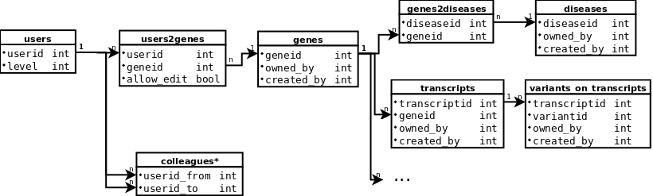

# LOVD3 Access Control

In LOVD3, access to resources (objects like genes, diseases, variants) is 
controlled via user *levels* (roles) and *ownership* of the objects.
The user levels are either global or contextual. Global user levels grant
permissions on all objects. Contextual levels grant permission on objects
related to certain genes or users.

## Levels

The table below lists all user levels in LOVD3.

| Name         | IntVal | Type    | Summary                           |
| -------------| ------ | ------- | ----------------------- |
| SUBMITTER    | 1      | Global  | Anyone with a user account can view public objects |
| COLLABORATOR | 3      | Context | View in the context of a gene |
| COLLEAGUE\*  | ?      | Context | View/edit in the context of objects owned by *colleagues* |
| OWNER        | 4      | Context | View/edit in the context of a specific object |
| CURATOR      | 5      | Context | View/edit in the context of a gene |
| MANAGER      | 7      | Global  | Edit/view everything, including LOVD configuration |
| ADMIN        | 9      | Global  | Edit/view everything, install/upgrade LOVD |

\*COLLEAGUE is a proposed (april 2016) user level to share permissions between
users on the objects that they own.

## Database strucure

The diagram above shows part of the LOVD3 database schema relevant to access 
control. Users are stored together with their global user level in table 
*users*. For brevity, some tables for objects related to genes are not shown 
(e.g. *individual*, *screening*, etc.). Below is a list of contextual levels
and descriptions how they are determined.

COLLABORATOR

:   For an object X, a user's level is set to *COLLABORATOR* when X can be
    linked to a gene ID via joining with table *genes* (optionally via joins 
    on other tables like *genes2diseases*), and there is a record in 
    *users2genes* with the gene ID and the user's ID and *allow_edit* is set
    to false. The user can view but not edit X. Example SQL:
~~~SQL
    SELECT
      userid,
      allow_edit
    FROM users2genes AS u2g JOIN genes2diseases AS g2d ON (u2g.geneid = g2d.geneid)
    WHERE g2d.diseaseid = 1;
~~~

COLLEAGUE

:   *(proposition, april 2016)* For an object X, owned by user A. User B 
    obtains level *COLLEAGUE* when there is a record in *colleagues* where
    *userid_from* is A's ID and *userid_to* is B's ID. User B can view/edit
    object X. Example SQL:
~~~SQL
    SELECT
      *
    FROM colleagues AS c JOIN diseases AS d ON (c.userid_from = d.owned_by)
    WHERE c.userid_to = 1;
~~~

OWNER

:   For an object X, user A can view/edit X if the object's field *owned_by* is
    A's ID. Then the user level is set to *OWNER*.

CURATOR

:   The *CURATOR* user level is set in a similar manner compared to level 
    COLLABORATOR, only now the field *allow_edit* in table *users2genes* is
    true and the user can also edit the object.

